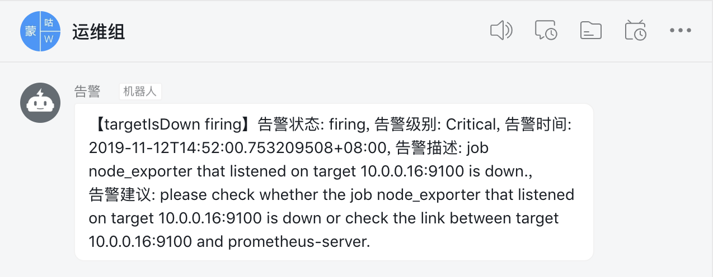

# prometheus_alertmanager_dingtalk

## prometheus 配置

### prometheus-server 配置文件

prometheus.yml

```
global:
  scrape_interval: 15s
  evaluation_interval: 2s
  external_labels:

# 配置告警规则文件目录
rule_files:
  - /etc/prometheus/rules/up.yml

scrape_configs:
  - job_name: 'prometheus'
    scrape_interval: 180s
    scrape_timeout: 10s
    static_configs:
      - targets:
          - "10.0.0.16:9091"

  - job_name: 'node_exporter'
    scrape_interval: 2s
    static_configs:
      - targets:
          - "10.0.0.16:9100"

# Alertmanager配置项
alerting:
  alertmanagers:
    - scheme: http
      static_configs:
        - targets:
          - "10.0.0.16:9093"
```

### prometheus alert rule

up.yml内容
```
---
groups:
  - name: targetAlarms
    rules:
      - alert: targetIsDown
        expr: up{job!="ssl_exporter"} == 0
        for: 15s
        labels:
          severity: Critical
          description_id: 701
        annotations:
          description: >-
            job {{ $labels.job }} that listened on target {{ $labels.instance }} is down.
          summary: >-
            job {{ $labels.job }} that listened on target {{ $labels.instance }} is down.
          suggestion: >-
            please check whether the job {{ $labels.job }} that listened on target
            {{ $labels.instance }} is down or check the link between target
            {{ $labels.instance }} and prometheus-server.
          resource_type: virtual.prometheus
          sub_resource_type: target
          alert_target: "{{ $labels.instance }}"
          alert_target_id: "{{ $labels.serialnumber }}"
 ```

## alertmanager 配置
```
---
global:
  resolve_timeout: 5m
  http_config:
    tls_config:
      insecure_skip_verify: true
route:
  group_by: [alertname]
  group_wait: 1s
  group_interval: 10s
  repeat_interval: 1h
  receiver: 'web.hook'
  routes:
    - receiver: 'web.hook'

receivers:
  - name: 'web.hook'
    webhook_configs:
      # prometheus_alertmanager_dingtalk 
      - url: 'http://127.0.0.1:8060/'
        send_resolved: true
inhibit_rules:
  - source_match:
      severity: 'Critical'
    target_match:
      severity: 'Warning'
    equal: ['alertname', 'instance']
```

## prometheus_alertmanager_dingtalk 启动

### 配置文件prom-dingtalk.conf

/etc/container/prometheus_dingtalk/prom-dingtalk.conf

```
[server]
port=8060
addr=127.0.0.1

[dingtalk]
# webhook
token_url='https://oapi.dingtalk.com/robot/send?access_token=XXX
# 加签
secret='XXXX'
```

### docker 启动prometheus_alertmanager_dingtalk

```
docker run -d -p 8060:8060 --net=host --restart=always --name dingtalk -v /etc/localtime:/etc/localtime:ro -v /etc/container/prometheus_dingtalk:/etc/prometheus_alertmanager_dingtalk prometheus_alertmanager_dingtalk:latest
```

## 测试
我的环境是部署了node-exporter的，下面我将它down掉，观察机器人是否向运维群发送了通知

```
docker stop node_exporter
```
稍后可以观察到运维群收到机器人的通知：

 
